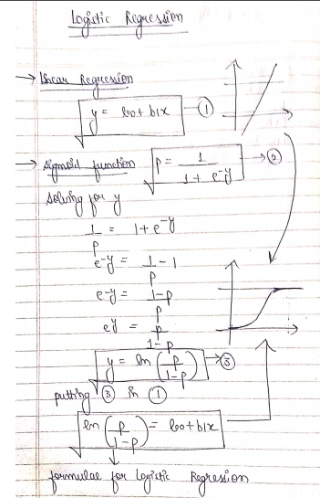

## Logistic Regression

In Logistic Regression problem, our dependent variable is **Categorical** or is classified in certain type of data.

**For example:** In an Action vs Age graph for the same advertisement of a insurance shown on a Youtube video, we can see that there are only two possibilities. Either the user takes action and click on the ad link or ignores the ad by skipping it.
Thus, our dependent variable (Action) can take only two values, YES/1/HIGH or NO/0/LOW form.

Such type of data cannot be solved by Linear Regression.

For above example, we can say by intution that aged people would take action more than younger people but we cannot state that with a guarentee. This is the key idea of Logistic Regression, we don't predict the outcome, we predict the probability of the outcome.
Based on this probability, we take further decisions. 
So considering probability of young audience opening an insurance ad is less, we can show them an ad related to Cricket etc.

**Modifying Linear Regression into Logistic Regression for 2 category dependent variable**

Here, the probabilites lies in the range [0,1] and we can state that first category (low) has a probability 0 and second category (high) has a probabilty 1.
* The linear regression line between 0 horizon and 1 horizon is an effective measure of probability 
* Left to 0 horizon and regression intersection means 0 probability
* Right to 1 horizon and regression interection means 1 probability

**Actual Values for dependent variables:**

For Independent variable, drop perpendicular to regressor.
From regressor intersection, drop perpendicular to dependent variable axis to get the actual probability.

**Predicting probability for dependent variables:**

Take an average probability line and all the values on regressor below it lead to prediction of zero probability and vice-versa

